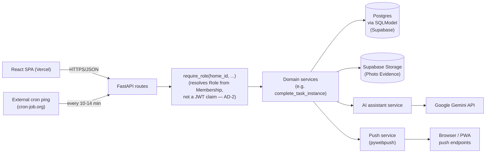
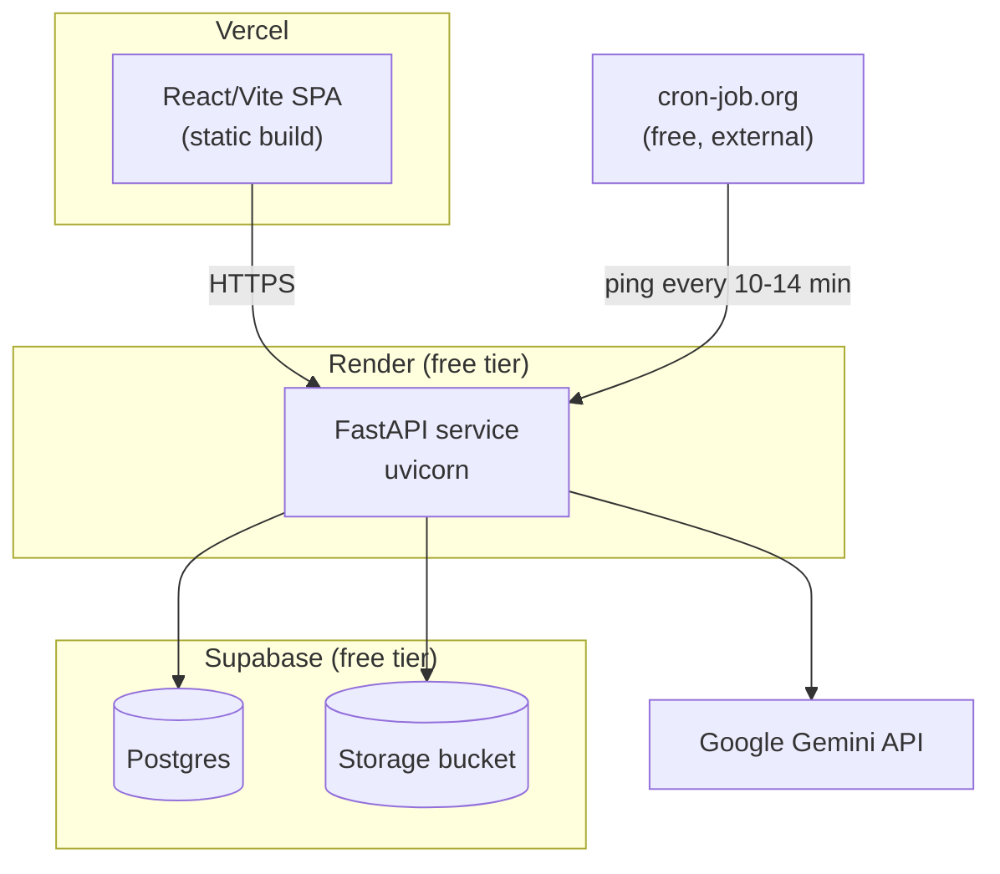
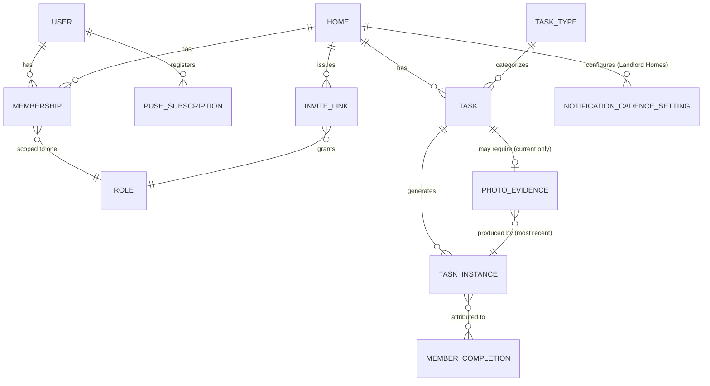

# Architecture Spine — Husly

## Design Paradigm

Layered client-server: a React SPA (presentation only) calls a single FastAPI REST API. Inside the API, every mutating or permission-sensitive operation flows through one domain-service layer before touching persistence — routes never mutate data or call external services directly.



Layers may only depend downward (UI → routes → permission → domain → persistence/external adapters). Nothing below the domain layer may import or call back up into routes or UI.

## Invariants & Rules

### AD-1 — Role lives on Membership, not on the User account

- **Binds:** FR-1, FR-2, FR-3, data model
- **Prevents:** a model where Role sits on the User account, which would block a user holding different Roles in different Homes.
- **Rule:** Role is a field on the User↔Home join entity (Membership), never on User. One User row can have many Membership rows, each with its own Role scoped to one Home. `[ADOPTED]` — resolves PRD Open Question 3.

### AD-2 — Server-side permission enforcement resolves Role per-Home, never from a token claim

- **Binds:** FR-3, FR-5, FR-8, FR-13, Cross-Cutting NFR "Permission enforcement"; depends on AD-1
- **Prevents:** a flat `role` JWT claim, which would be wrong the moment a user holds different Roles in different Homes (AD-1) — e.g. correctly enforced as Landlord in Home A but incorrectly enforced as that same flat role in Home B.
- **Rule:** The JWT carries only identity (`user_id`) — never a Role claim. Every Home-scoped route takes `home_id` as a path parameter; its `require_role(home_id, allowed_roles)` dependency loads the caller's Membership row for `(user_id, home_id)` from the database and checks *that* row's Role. A user with no Membership in the target Home is rejected regardless of their Role elsewhere. No route reads Role from the request body or query params.

### AD-3 — One domain function owns task-completion state

- **Binds:** FR-7, FR-9, FR-17, FR-19
- **Prevents:** the self-checkoff path (FR-17) and the photo-evidence-upload path (FR-19) rescheduling or attributing completion differently from each other.
- **Rule:** A single domain function (`complete_task_instance`) is the only code path that marks a Task instance complete, records attribution, and triggers FR-9's reschedule-from-completion-date. Both the checkbox endpoint and the photo-upload endpoint call it; neither duplicates its logic. The function is idempotent: calling it again on an already-completed instance (e.g. a retried request) returns the existing completion state unchanged rather than re-attributing or re-scheduling.

### AD-4 — AI assistant calls are server-mediated through one service

- **Binds:** FR-14, FR-15, FR-16
- **Prevents:** the chemical-caution disclaimer (FR-14/15) drifting or disappearing on one of the two AI entry points; the Gemini API key leaking to the client; uncontrolled client-side call volume against the free-tier rate limit.
- **Rule:** React never calls the Gemini API directly. One backend AI service wraps every Gemini call (quick-answer, chat, onboarding-guide generation) and injects the disclaimer from a single shared constant. Every AI response is a structured object — `{status: "ok" | "low_confidence" | "error", answer: string, disclaimer: string}` — with the disclaimer always its own field, never concatenated into `answer`. This way no AI surface can silently drop the disclaimer by string-handling it differently, and EXPERIENCE.md's three AI UI treatments render consistently off the same `status` value regardless of which component calls it. The onboarding guide (FR-16) is generated once per Home at provisioning time and persisted, not regenerated on every view — keeps content stable and avoids burning the free-tier Gemini quota on repeat views.

### AD-5 — Photo Evidence belongs to the Task, not the Task Instance

- **Binds:** FR-19
- **Prevents:** a per-TaskInstance PhotoEvidence record implying a photo history (contradicting FR-19's "no accumulating history"), and the ambiguity of which instance's evidence record points at the single stored photo after a recurring task's 2nd+ completion.
- **Rule:** `PhotoEvidence` is 1:1 with `Task` (the recurring task definition), not with `TaskInstance` — it represents "the current evidence for this Task," with a field recording which `TaskInstance` most recently produced it (for the Landlord's "when/by whom" review). Each task's required photo is stored under a fixed, server-computed key (`tasks/{task_id}/evidence.jpg`) in Supabase Storage; a new upload overwrites that key and updates the pointer — no code path appends a new key or a new PhotoEvidence row per completion.

### AD-6 — Photo Evidence eligibility is enforced in the data layer

- **Binds:** FR-18, PRD Privacy Constraints
- **Prevents:** a direct API call letting a Landlord require Photo Evidence on a privacy-sensitive task type, bypassing a UI-only restriction.
- **Rule:** Task types carry a system-seeded `photo_evidence_eligible` flag, not Landlord-editable. The endpoint that sets FR-18's requirement rejects the request server-side if the Task's type isn't flagged eligible.

### AD-7 — Auth: in-memory access token + httpOnly refresh cookie

- **Binds:** all authenticated routes; Cross-Cutting NFR "Permission enforcement"
- **Prevents:** storing a JWT in `localStorage` (XSS-exposed) or relying on a same-origin assumption that breaks once frontend (Vercel) and backend (Render) are on different domains.
- **Rule:** A short-lived JWT access token is returned in the login response body and kept only in React memory. A long-lived refresh token is set as an `httpOnly`, `Secure`, `SameSite=None` cookie, exchanged only at a dedicated `/refresh` endpoint. Both halves of cross-origin credentialed cookies are named explicitly so neither is forgotten: the backend's CORS config lists the exact Vercel origin with `allow_credentials=True` (never a wildcard origin, which browsers reject when credentials are involved), and the one generated API client (AD-11) sends every request with `credentials: "include"`.

### AD-8 — Due-check runs on an external cron trigger, not an in-process scheduler

- **Binds:** FR-10, FR-11, FR-12, FR-13, Cross-Cutting NFR "Notification reliability"
- **Prevents:** an in-process scheduler (e.g. APScheduler) never firing because Render's free tier spins the service down after 15 minutes idle.
- **Rule:** A dedicated `POST /internal/run-due-check` endpoint runs the due/overdue scan (push notifications, FR-11's fairness nudge) and is the only thing that triggers it. An external free cron service (cron-job.org) calls it every 10–14 minutes, which also keeps the Render instance awake and incidentally keeps Supabase's free-tier project from auto-pausing after 7 days of DB inactivity (web-verified; the due-check job touches the DB every cycle). The endpoint is safe to call concurrently or more often than scheduled: it tracks, per Task Instance, whether a notification has already been sent for the current due/overdue window, so a duplicate or overlapping trigger never double-sends. `[ADOPTED]` — resolves PRD Open Question 2 (delivery window = "checked every ~10–14 min," not immediate, unless upgraded to the paid tier). `[ASSUMPTION: Render's own docs call this pattern unsupported/not guaranteed — acceptable risk for a course project; reversible to Render's paid tier without any code change if it proves unreliable. Note: keeping the service always-on this way consumes nearly all of Render's 750 free instance-hours/month (~720-744h/month) — fine if this is the only free Render service in use, but leaves no headroom for a second one on the same account.]`

### AD-9 — FR-11 fairness-nudge rule

- **Binds:** FR-11
- **Prevents:** an unbounded/vague "rarely or never" trigger that can't be tested.
- **Rule:** The due-check job (AD-8) fires a targeted nudge to a Member who has 0 completions in the last 3 instances of a given recurring shared task, provided at least one other Member completed at least one of those 3. `[ADOPTED]` — resolves PRD Open Question 4.

### AD-10 — No real-time layer

- **Binds:** FR-7
- **Prevents:** building WebSocket/SSE infrastructure the UJs don't actually require.
- **Rule:** Freshness is achieved by TanStack Query refetching on mount and window-focus. No push-to-open-screen mechanism exists for task state (distinct from AD-8's push *notifications*, which are a separate, explicit channel).

### AD-11 — Frontend reads server state only through TanStack Query

- **Binds:** all FRs with a UI
- **Prevents:** components built by different team members caching or revalidating the same data inconsistently (e.g. one polling, one never refetching).
- **Rule:** No component calls `fetch`/`axios` directly or holds server data in local `useState`. All server reads/writes go through TanStack Query hooks backed by one generated API client. The plain self-checkoff mutation (FR-17) specifically uses TanStack Query's optimistic-update pattern (instant UI flip, quiet retry/rollback on failure) — matching EXPERIENCE.md's offline/optimistic-update state. The photo-evidence-upload mutation (FR-19) is deliberately **pessimistic** instead — the UI waits for the upload-and-auto-approve response before showing complete — since an upload has a real failure mode a checkbox tap doesn't, and the Landlord's review view must never show evidence that doesn't yet exist server-side.

### AD-12 — The app ships as an installable PWA

- **Binds:** FR-10, FR-21
- **Prevents:** building Web Push (AD-8) without the one prerequisite that makes it work on iPhone at all, and three developers each guessing differently at whether/how install is prompted.
- **Rule:** `frontend/` includes a `manifest.json` and a registered service worker from day one (not added later), plus a single shared "Add to Home Screen" install-prompt component shown once per Member **per device** (tracked client-side, e.g. `localStorage` — a Member's second device gets its own prompt). This is required for AD-8's Web Push to reach iOS Safari users (web-verified: iOS 16.4+ only supports Web Push for a Home-Screen-installed PWA).

### AD-13 — Design tokens are implemented as one generated source, never hardcoded

- **Binds:** FR-21, Cross-Cutting NFR "Responsiveness", DESIGN.md's color/typography/spacing/rounded tokens
- **Prevents:** one developer hardcoding a hex/px value (e.g. `#7B6EE3`) while another references a token, causing silent visual drift across the three developers' components.
- **Rule:** DESIGN.md's tokens are implemented once as CSS custom properties (`:root { --color-primary: #7B6EE3; ... }`) generated/copied directly from DESIGN.md's frontmatter, not re-typed per component. No component file contains a literal hex color, px size, or border-radius value — only a `var(--...)` reference.

### AD-14 — Landlord broadcast (FR-12) is a direct, immediate send — not routed through the due-check job

- **Binds:** FR-12
- **Prevents:** a Landlord's ad-hoc message silently inheriting AD-8's 10–14 minute cron cadence, when the PRD expects it sent as soon as the Landlord submits it.
- **Rule:** The broadcast endpoint calls the push-sending domain function directly and synchronously on request, independent of the `/internal/run-due-check` job. AD-8 governs only the due/overdue scan and FR-11's fairness nudge, never FR-12.

## Consistency Conventions

| Concern | Convention |
| --- | --- |
| Naming (entities, files, interfaces, events) | Entity names match the PRD Glossary verbatim: `Home`, `Member`, `Role`, `Task`, `TaskInstance`, `Frequency`, `PhotoEvidence`, `NotificationCadence`. No synonyms (e.g. never `User` for the Home-scoped actor — that's `Member`; `User` is the account row). |
| Data & formats (ids, dates, error shapes, envelopes) | IDs: UUIDv4 everywhere. Dates/times: ISO 8601 in UTC on the wire, converted client-side for display. Errors: FastAPI's default `{"detail": "..."}` shape; validation errors use FastAPI/Pydantic's standard 422 body, never a bespoke envelope. |
| State & cross-cutting (mutation, errors, logging, config, auth) | Mutations only via domain services (AD-3). Auth via the `require_role` dependency (AD-2). Secrets (Gemini key, VAPID keys, DB URL, JWT signing key) via environment variables only, never committed. Frontend API types generated from the backend's OpenAPI schema (`openapi-typescript`), never hand-written. |
| Schema changes (single shared dev database) | Every schema change is an Alembic migration committed to the repo — never a manual change against the shared Supabase instance. Whoever pulls a migration runs it before starting work; announce a schema change to the other two before pushing it, since all three share one dev database with no isolation. |

## Stack

| Name | Version |
| --- | --- |
| Python | 3.12+ |
| FastAPI | latest 0.14x (0.141.x current at authoring, Oct 2026 — pin exact patch at setup time) |
| SQLModel | latest (0.0.47+; tracks SQLAlchemy 2.0.5x since v0.0.19 — no 1.x pin, web-verified Oct 2026) |
| Alembic | latest (schema migrations for SQLModel/SQLAlchemy) |
| PostgreSQL | via Supabase managed Postgres |
| pywebpush | latest (VAPID Web Push) |
| google-genai | latest (official Gemini SDK; supersedes deprecated `google-generativeai`) |
| React | latest 19.x (19.2 current at authoring — pin exact minor at setup time) |
| TypeScript | latest stable |
| Vite | latest (the community-standard build tool since `create-react-app`'s 2025 deprecation) |
| TanStack Query | latest (v5) |
| Node.js | current LTS (for Vite tooling) |

## Structural Seed

### Deployment & environments



One shared environment covers both development and the course demo/submission — no separate staging, given the 3-person/13-week scope. All three developers point at the same Supabase project.

### Core entities (names + relationships only)



`TASK_TYPE` is the system-seeded catalog AD-6 presumes — each row carries the `photo_evidence_eligible` flag; `TASK` references one `TASK_TYPE` and never defines eligibility itself. `PHOTO_EVIDENCE` is per-`TASK` (AD-5), not per-`TASK_INSTANCE` — see AD-5 for why. `INVITE_LINK` carries its own validity state (token, target Role, used/expired/revoked) distinct from `MEMBERSHIP` — EXPERIENCE.md's "invalid/expired invite link" and "duplicate registration attempt" states need something to check against before a Membership exists. `[ASSUMPTION: default policy is single-use + 7-day expiry, regenerable by whoever can invite (AD-2); confirm with the team before building, easy to change since it's just two column defaults.]` `PUSH_SUBSCRIPTION` holds each browser/device's Web Push endpoint + keys per User (a User may have more than one, one per installed device) — needed for AD-8/AD-12 to know where to send a notification, and to represent EXPERIENCE.md's "no push permission granted" state.

### Source tree

```text
/
  frontend/          # React + Vite + TypeScript SPA
    public/
      manifest.json   # PWA manifest (AD-12)
    src/
      api/            # generated OpenAPI client + TanStack Query hooks
      components/
      routes/
      styles/         # CSS custom properties generated from DESIGN.md tokens (AD-13)
      service-worker.ts  # Web Push + PWA install (AD-8, AD-12)
  backend/            # FastAPI service
    app/
      routes/         # thin HTTP layer — no business logic
      domain/         # domain services (AD-3, AD-4); the only mutation path
      permissions/    # require_role dependency (AD-2)
      models/         # SQLModel entities
      ai/             # Gemini-wrapping AI service (AD-4)
      notifications/  # pywebpush sender + due-check job (AD-8)
```

## Capability → Architecture Map

| Capability / Area | Lives in | Governed by |
| --- | --- | --- |
| Homes & Membership (FR-1–3) | `backend/app/domain`, `models` | AD-1, AD-2 |
| Task Overview & Must/Should (FR-4–7) | `backend/app/domain`, `frontend/src/components` | AD-3, AD-11 |
| Frequency & Scheduling (FR-8–9) | `backend/app/domain` | AD-3 |
| Notifications (FR-10–13) | `backend/app/notifications` | AD-8, AD-9, AD-14 |
| AI Assistant (FR-14–16) | `backend/app/ai` | AD-4 |
| Completion & Photo Evidence (FR-17–19) | `backend/app/domain` | AD-3, AD-5, AD-6, AD-11 |
| Landlord Portfolio Dashboard (FR-20) | `frontend/src/routes`, `backend/app/routes` | AD-11 |
| Responsive Platform (FR-21) | `frontend/` (PWA shell, design tokens) | AD-12, AD-13 |

## Deferred

- **Observability/logging strategy** — not fixed at this altitude; left to whatever Render/Supabase provide by default plus `print`/basic logging for this course project's scale. Revisit if the team hits a debugging wall.
- **Automated testing strategy** — not fixed here (pytest for backend, Vitest for frontend are the obvious defaults but not binding); left to sprint planning/story level.
- **PRD Open Question 1 (scope cut order)** — explicitly a PM/scope call, not an architecture one; the PRD's own provisional cut order stands.
- **Rate-limiting/abuse protection on the AI endpoints** — beyond "one backend service" (AD-4) and the Gemini free-tier's own cap, no additional throttling is designed; acceptable at this user scale.
- **Internationalization/localization infrastructure** — UX's Norwegian-only-for-v1 assumption stands; no i18n library wired in.
